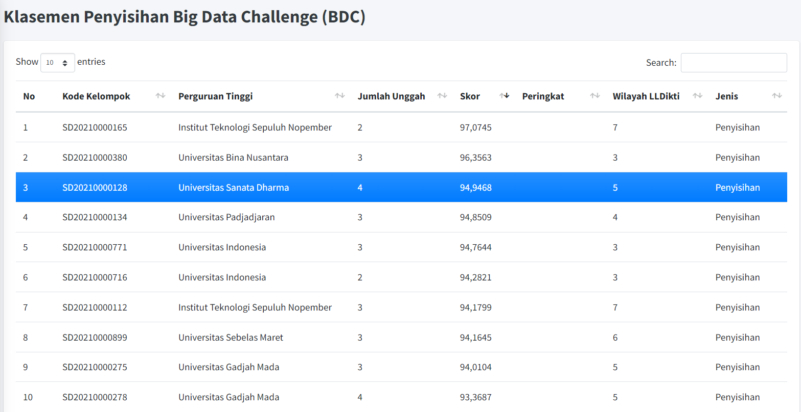
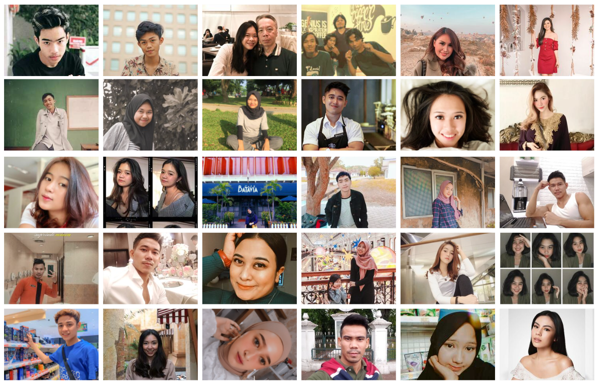
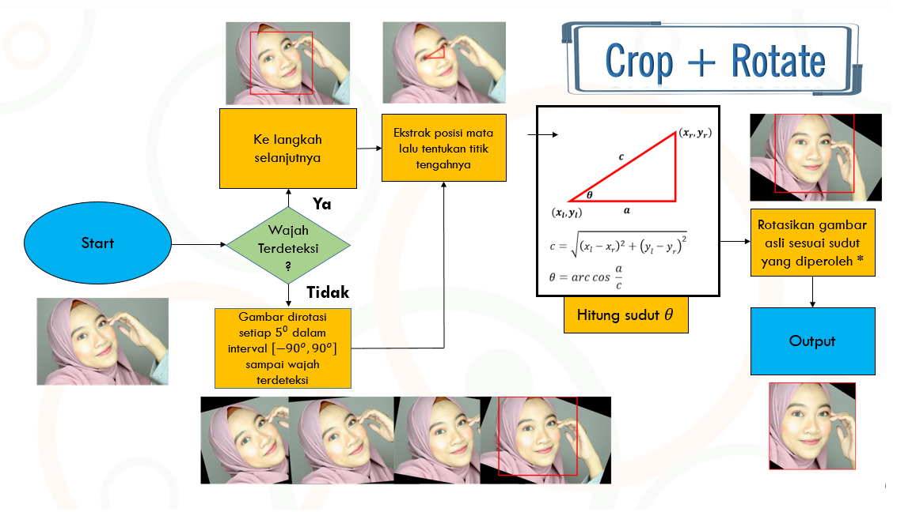
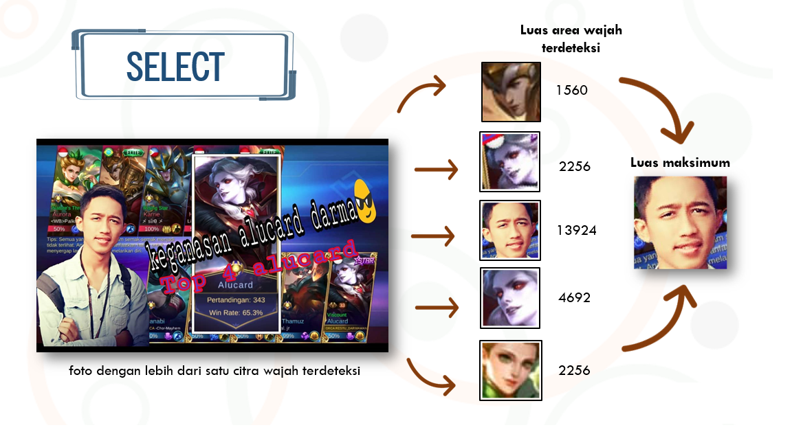
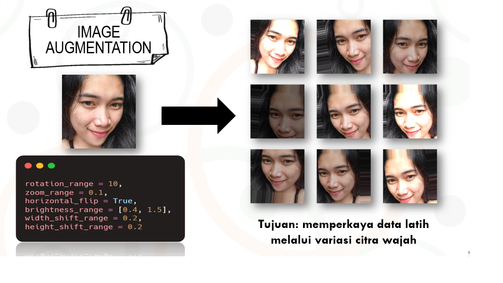
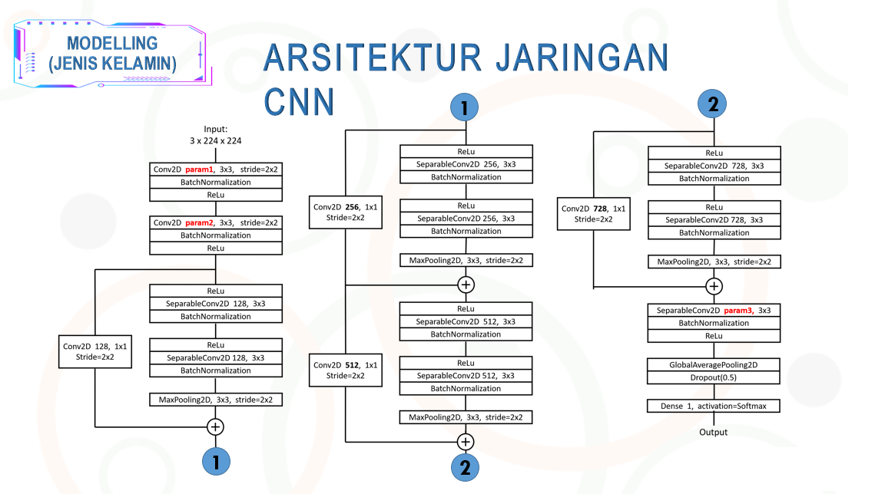
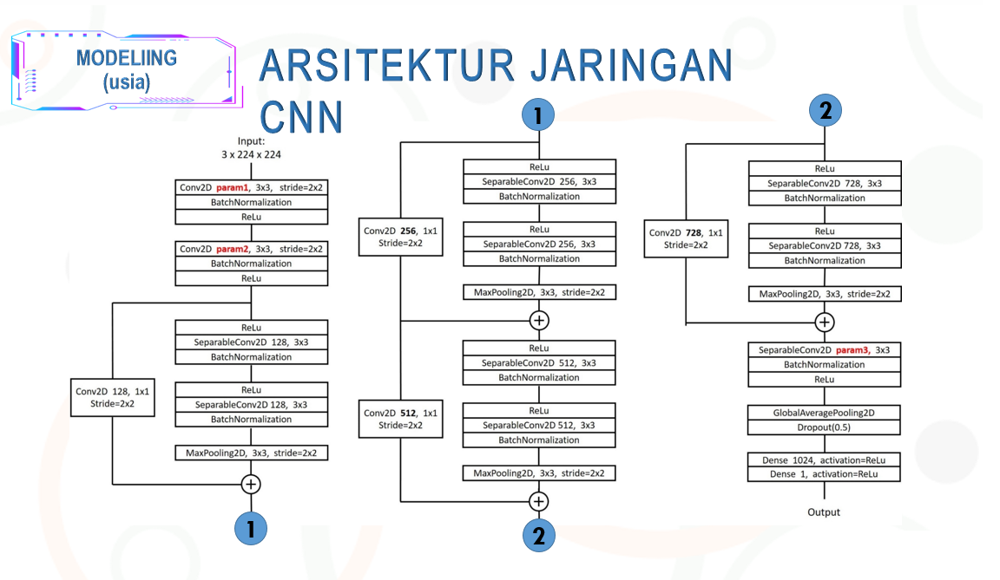
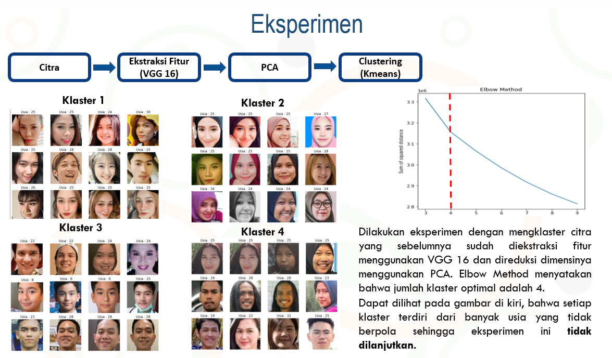
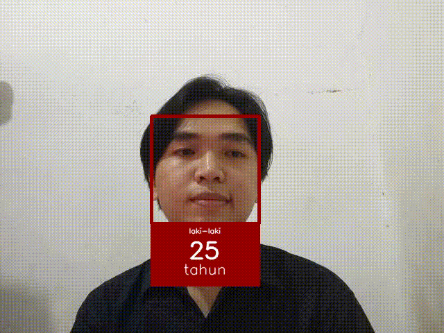

# Big Data Challenge - Satria Data 2021

Tim : 

Universitas Sanata Dharma Yogyakarta | `SD20210000128`

|     |     |
| --- | --- |
| Ignatius Sarwo Edhi Wiyoto   |  |
| Ferdinandus Steven Millicent |  |
| Albert Ricky Setiawan        |  |

 

Repository ini digunakan untuk merekam kegiatan lomba Big Data Challege - Satria Data 2021 yang diikuti oleh tim dari program studi Matematika Universitas Sanata Dharma Yogyakarta. Tim berhasil menjadi finalist dan memperoleh peringkat ketiga F1-Score terbaik untuk model jenis kelamin. Metodologi selengkapnya dapat dilihat pada [`Metodologi`](https://github.com/isew25/BDC-Satria-Data-2021/blob/main/Report.pdf).

## Task

Memprediksi Jenis Kelamin dan Usia seseorang dari gambar. Pada lomba ini, tidak diperkenankan menggunakan transfer learning, penggunaan arsitektur model pada [`Keras Model`](https://keras.io/api/applications/) diperbolehkan tetapi harus di set `weights=None`.

## Preprocessing
Proses ini bertujuan untuk menyeragamkan data, dalam hal ini proses penyeragaman yang dilakukan adalah memotong gambar pada bagian wajah dan merotasi gambar sehingga semua pose wajah menjadi lurus. Pada data latih dan uji terdapat gambar yang memuat beberapa wajah, kami melakukan preprocessing dengan memilih wajah yang terbesar pada gambar. 
Data latih dikenakan preprocessing lalu disimpan ke dalam satu folder, hal ini dilakukan agar pada proses selanjutnya dapat dilakukan augmentasi 
gambar dengan lebih mudah dan menghindari resiko gagal crop. Sementara pada data uji proses crop hanya dilakukan ketika data ingin diprediksi, hal ini akan lebih 
efisien terutama jika model akan diaplikasikan nanti.
Library yang kami gunakan dalam proses ini adalah [`face_recognition`](https://github.com/ageitgey/face_recognition).

1. Crop + Rotate
    
    
2. Select
    

## Augmentasi

## Modelling
Artitektur model yang kami gunakan dapat dilihat pada gambar di bawah. Untuk detail mengapa kami memilih menggunakan arsitektur ini dan kelebihan dari arsitektur ini dapat pada [`Metodologi`](https://github.com/isew25/BDC-Satria-Data-2021/blob/main/Report.pdf).
1. Model Jenis Kelamin
    
 
2. Model Usia
    

## Eksperimen
Kami melakukan eksperimen dengan mengklaster gambar untuk memperoleh insight, tetapi eksperimen ini tidak dilanjutkan karena tidak ada insight yang dapat diambil.

## Deployment
Model yang kami hasilkan dapat memprediksi usia dan jenis kelamin secara realtime dengan cukup baik. 

